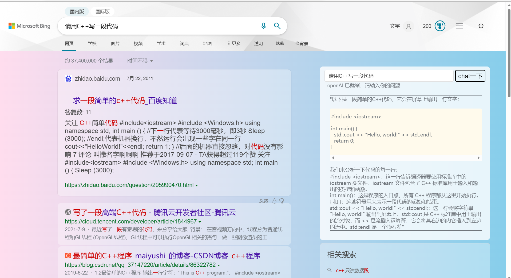

# chatGPT tools plus++

# Usage
+ Open the Tampermonkey plug-in to install
 

# Effects preview

 

# Introduction

+ Is currently one of the best ChatGPT plugins for Oil Monkey
+ Same speed as plugin version  
+ Tampermonkey link
<a href="https://greasyfork.org/zh-CN/scripts/456131-chatgpt-tools-plus-cookie%E7%89%88">chatGPT tools plus++</a>

# Thank you
+ Thank zhengbangbo initially inspired the disposal method of SSE  the script for the [his script](https://greasyfork.org/zh-CN/scripts/456077-chat-gpt-search-sidebar)

# Update diary
V0.0.1 ~ v0.4.5  
demo version  
v1.2.1  
In the official version, the verbatim display and markdown parsing boundary highlighting have been added