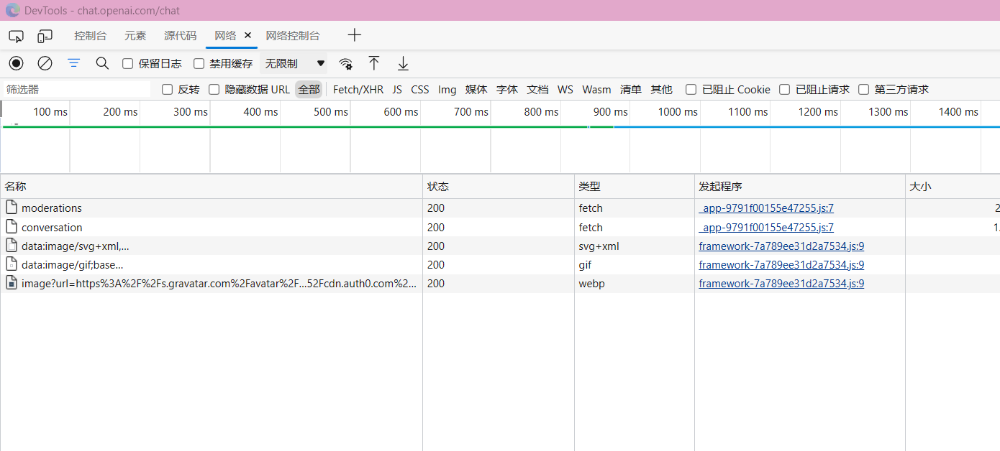
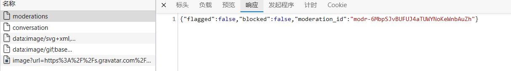
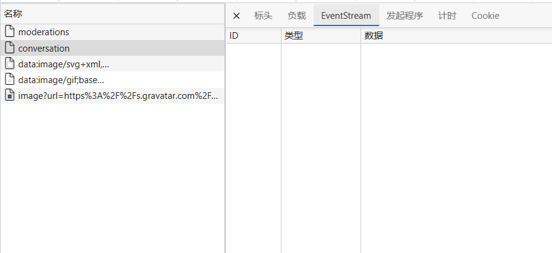
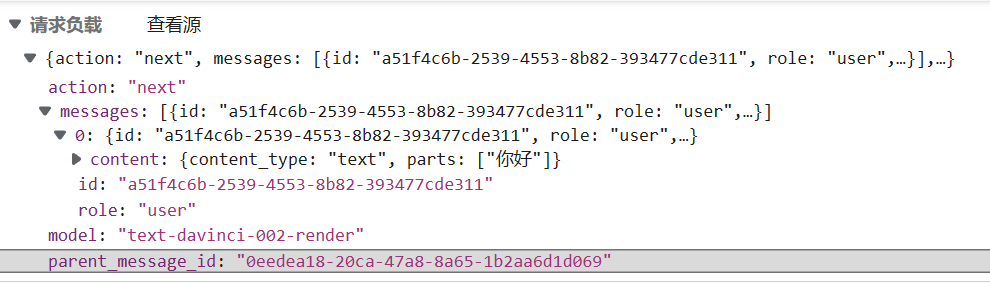
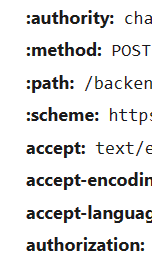
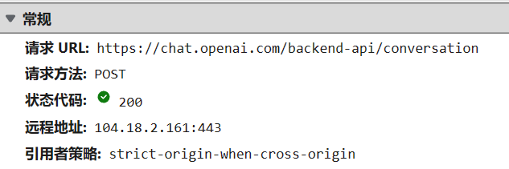

# chatGPT 接入搜索引擎实战教学（一）开端

# chatGPT tools plus++

<a href="https://greasyfork.org/zh-CN/scripts/456131-chatgpt-tools-plus-cookie%E7%89%88"></a> <a href="https://github.com/LiWeny16/chatGPT-tool-plus/blob/main/LICENSE"></a> <a href="https://github.com/LiWeny16/chatGPT-tool-plus"></a>
<a href="https://scriptcat.org/script-show-page/756"></a>
<a href="https://bigonion.cn"></a>


# [English Version](README-EnglishVer.md)

## 难度级别

- **草履虫**
- ~~大妈~~
- ~~小学生~~
- ~~博士生~~

## 起因

chatGPT 出来之后就想做一个嵌入搜索引擎的快捷搜索脚本，同时又看到了插件版的出现，本着油猴能做到的事情就别用插件的基本原则，于是开启了这个项目

## 工具

edge&&chrome

## 油猴第一步，抓包<br>

这是原页面，那么我们要怎么抓包呢？对于 Http 包，我们在浏览器就可以抓到啦，chrome 按下 F12，来到 network/网络这个选项
<br>
在向服务器发送一段问题的时候抓取报文  
我们可以清晰可见的看到  
已经出现了两个包了  
一个是 moderations 一个是 conversations
走，看看去  

啊咧这响应是啥，应该不是这个包
那应该是第二个了吧！  
<br>
我去这更离奇了，EventStream 是什么啊，从来没见过，而且这里怎么是全白的啊？？

### `完了,难道我的梦想就要破碎了吗，难道我只能止步于此了吗?`

噢不，我还会查！
查啊差啊查，找到了 zhengbangbo 大佬的脚本  
[https://greasyfork.org/zh-CN/scripts/456077-chat-gpt-search-sidebar](https://greasyfork.org/zh-CN/scripts/456077-chat-gpt-search-sidebar)  
但是他也不会接收 eventStream 类型的传输！  
但是他提供了一个思路，就是用 onloadend 方法是可以接收到完整数据的,那么我们暂且不用管 eventStream 这件事情，先做出个样子出来！  
首先我们已经确认了真正的问题请求包是在 conversation 那么第一步我们看看这个 conversations 到底发了什么玩意吧！  

可以很清楚看到里面的 JSON 结构

```js
{
    "action":"next",
    "messages":[
        {
            "id":"a51f4c6b-2539-4553-8b82-393477cde311",
            "role":"user",
            "content":{
                "content_type":"text",
                "parts":[
                    "你好"
                ]
            }
        }
    ],
    "parent_message_id":"0eedea18-20ca-47a8-8a65-1b2aa6d1d069",
    "model":"text-davinci-002-render"
}
```

先找不变的量  
action 一直都是 next，role 一直是 user，content_type 是 text，model 是 text-davinci-002-render  
Id 和 parentId 是用的 UUIDv4 的生成函数，parts 里面是你的问题数组，好了我们开始构造发包内容吧，这里用到且必须使用油猴提供的 GM 函数，因为涉及到跨域问题，不懂跨域？[点我了解跨域](https://blog.csdn.net/lambert310/article/details/51683775) , 所以这里用的是 GM_xmlhttpRequest 函数，想要使用，必须在头部里面申请

```js
// @grant       GM_xmlhttpRequest
```

接下来是对请求头的构造，查看原头有 Authorization:<br>  
是比较重要的头其他都基本可以忽略,具体怎么获取就在控制台里写着呢，自己复制粘贴 authorization 后面的内容

好了开始构造

```js
GM_xmlhttpRequest({
  method: "POST",
  url: "https://chat.openai.com/backend-api/conversation",
  headers: {
    "Content-Type": "application/json",
    Authorization: `your_cookie`,
  },
  data: JSON.stringify({
    action: "next",
    messages: [
      {
        id: uuid(),
        role: "user",
        content: {
          content_type: "text",
          parts: [your_qus],
        },
      },
    ],
    model: "text-davinci-002-render",
    parent_message_id: uuid(),
  }),

  onloadend: function (data) {
    console.log(data);
  },

  onerror: function (err) {
    console.log(err);
  },
  ontimeout: function (err) {
    console.log(err);
  },
});
```

好的具体什么意思呢，让我们一行一行给草履虫们来解释吧！  


- method:指的是请求方式，一般 POST 被认为是提交给服务器，GET 被认为是向服务器拿东西，从抓包信息可以看到
- url:请求的 URL 地址，从抓包信息可以看到
- data:指的是你要给服务器发送的数据，为什么要 JSON.stringify，因为他只能接收字符串，不支持 JSON 格式，但是 JSON 格式方便你自己理解和撰写代码
- onloadend:指的是请求结束之后,对数据进行接收和回调处理，第一个参数默认就是返回的数据
- onerror，ontimeout 顾名思义，超市，错误的回调函数

好了这下试试看能不能行，哇，果然拿到了
但是怎么这么乱啊，于是对其进行一点简单的处理就可以拿到数据了~~参考 zhengbangbo 处理~~

```js
if (data.response) {
  const answer = JSON.parse(
    data.response.split("\n\n").slice(-3, -2)[0].slice(6)
  ).message.content.parts[0];
  document.getElementById("gptAnswer").innerHTML = answer;
}
```

好了我们成功拿到数据了！  
这个脚本算是成功一大半了

可是，我们没法做到数据开始传输的时候就进行显示和接收，这是 EventStream 类型的特征，而油猴没办法做到 EventStream 接收，问了很多人(道哥)也没有结果，查了很久也没有方法，这就导致了要化很长很长的时间去等待接受完毕再展示出来，这对于用户体验上来说是难以接受的

前前后后  
找到了 MDN 对于此数据类型接收的解释  
[https://developer.mozilla.org/zh-CN/docs/Web/API/ReadableStream](https://developer.mozilla.org/zh-CN/docs/Web/API/ReadableStream)  
但是他用的是 fetch 方法来调用，这个对于油猴并没有什么价值  
查看插件版用的方法，是 fetchSSE 方法，对油猴也毫无帮助

真的累了

### `可能有时候，付出并没有什么用吧，无尽的付出，甚至连岁月的缺口，都填不上`

<br>
<br>

### `欸，油猴脚本注定将会被商店插件踩在脚下了`

<br>
<br>
<br>
<br>
<br>
<br>
<br>
<br>
<br>
<br>
<br>
<br>

## `吗？`

<br>
<br>
<br>
<br>
<br>

## 关于

作者：Onion  
邮箱：bigonion@bigonion.cn  
声明：未经本人同意，禁止转载、搬运、抄袭！

NameSpace: https://bigonion.cn  
Origin:https://bigonion.cn/blog

## (一)完结
