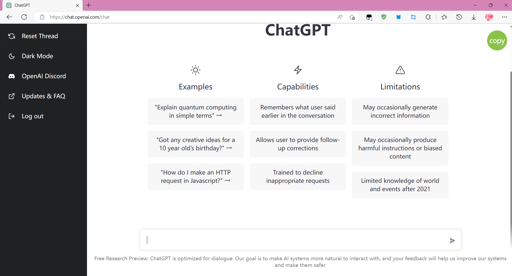

# chatGPT 接入搜索引擎实战教学（一）开端
# chatGPT tools plus++
<a href="https://greasyfork.org/zh-CN/scripts/456131-chatgpt-tools-plus-cookie%E7%89%88"></a>  <a href="https://github.com/LiWeny16/chatGPT-tool-plus/blob/main/LICENSE"></a>  <a href="https://github.com/LiWeny16/chatGPT-tool-plus"></a>
  <a href="https://scriptcat.org/script-show-page/756"></a>

# [English Version](README-EnglishVer.md)
## 难度级别
+ **草履虫**
+ ~~大妈~~
+ ~~小学生~~
+ ~~博士生~~
## 起因
chatGPT出来之后就想做一个嵌入搜索引擎的快捷搜索脚本，同时又看到了插件版的出现，本着油猴能做到的事情就别用插件的基本原则，于是开启了这个项目
## 工具
edge&&chrome
## 油猴第一步，抓包<br>
这是原页面，那么我们要怎么抓包呢？对于Http包，我们在浏览器就可以抓到啦，chrome按下F12，来到network/网络这个选项
<br>
在向服务器发送一段问题的时候抓取报文  
我们可以清晰可见的看到  
已经出现了两个包了  
一个是moderations 一个是 conversations
走，看看去  

啊咧这响应是啥，应该不是这个包
那应该是第二个了吧！  
<br>
我去这更离奇了，EventStream是什么啊，从来没见过，而且这里怎么是全白的啊？？  

### `完了,难道我的梦想就要破碎了吗，难道我只能止步于此了吗?`
噢不，我还会查！
查啊差啊查，找到了zhengbangbo大佬的脚本  
[https://greasyfork.org/zh-CN/scripts/456077-chat-gpt-search-sidebar](https://greasyfork.org/zh-CN/scripts/456077-chat-gpt-search-sidebar)  
但是他也不会接收eventStream类型的传输！   
但是他提供了一个思路，就是用onloadend方法是可以接收到完整数据的,那么我们暂且不用管eventStream这件事情，先做出个样子出来！  
首先我们已经确认了真正的问题请求包是在conversation那么第一步我们看看这个conversations到底发了什么玩意吧！  

可以很清楚看到里面的JSON结构
```js
{
    "action":"next",
    "messages":[
        {
            "id":"a51f4c6b-2539-4553-8b82-393477cde311",
            "role":"user",
            "content":{
                "content_type":"text",
                "parts":[
                    "你好"
                ]
            }
        }
    ],
    "parent_message_id":"0eedea18-20ca-47a8-8a65-1b2aa6d1d069",
    "model":"text-davinci-002-render"
}
```
先找不变的量  
action一直都是next，role一直是user，content_type是text，model是text-davinci-002-render  
Id和parentId是用的UUIDv4的生成函数，parts里面是你的问题数组，好了我们开始构造发包内容吧，这里用到且必须使用油猴提供的GM函数，因为涉及到跨域问题，不懂跨域？[点我了解跨域](https://blog.csdn.net/lambert310/article/details/51683775) , 所以这里用的是GM_xmlhttpRequest函数，想要使用，必须在头部里面申请
```js
// @grant       GM_xmlhttpRequest
```
接下来是对请求头的构造，查看原头有 Authorization:<br>  
是比较重要的头其他都基本可以忽略,具体怎么获取就在控制台里写着呢，自己复制粘贴authorization后面的内容  

好了开始构造
```js
       GM_xmlhttpRequest({
            method: "POST",
            url: "https://chat.openai.com/backend-api/conversation",
            headers: {
                "Content-Type": "application/json",
                "Authorization": `your_cookie`,
            },
            data: JSON.stringify({
                action: "next",
                messages: [
                    {
                        id: uuid(),
                        role: "user",
                        content: {
                            content_type: "text",
                            parts: [your_qus],
                        },
                    },
                ],
                model: "text-davinci-002-render",
                parent_message_id: uuid(),
            }),

            onloadend: function (data) {
                console.log(data)
            },

            onerror: function (err) {
                console.log(err)
            },
            ontimeout: function (err) {
                console.log(err)
            }
        })
```
好的具体什么意思呢，让我们一行一行给草履虫们来解释吧！  

+ method:指的是请求方式，一般POST被认为是提交给服务器，GET被认为是向服务器拿东西，从抓包信息可以看到  
+ url:请求的URL地址，从抓包信息可以看到   
+ data:指的是你要给服务器发送的数据，为什么要JSON.stringify，因为他只能接收字符串，不支持JSON格式，但是JSON格式方便你自己理解和撰写代码  
+ onloadend:指的是请求结束之后,对数据进行接收和回调处理，第一个参数默认就是返回的数据
+ onerror，ontimeout顾名思义，超市，错误的回调函数  

好了这下试试看能不能行，哇，果然拿到了
但是怎么这么乱啊，于是对其进行一点简单的处理就可以拿到数据了~~参考zhengbangbo处理~~  
```js
if (data.response) {
                    const answer = JSON.parse(data.response.split("\n\n").slice(-3, -2)[0].slice(6)).message.content.parts[0]
                    document.getElementById('gptAnswer').innerHTML=answer
                }
```
好了我们成功拿到数据了！  
这个脚本算是成功一大半了  

可是，我们没法做到数据开始传输的时候就进行显示和接收，这是EventStream类型的特征，而油猴没办法做到EventStream接收，问了很多人(道哥)也没有结果，查了很久也没有方法，这就导致了要化很长很长的时间去等待接受完毕再展示出来，这对于用户体验上来说是难以接受的

前前后后    
找到了MDN对于此数据类型接收的解释    
[https://developer.mozilla.org/zh-CN/docs/Web/API/ReadableStream](https://developer.mozilla.org/zh-CN/docs/Web/API/ReadableStream)   
但是他用的是fetch方法来调用，这个对于油猴并没有什么价值    
查看插件版用的方法，是fetchSSE方法，对油猴也毫无帮助  

真的累了
### `可能有时候，付出并没有什么用吧，无尽的付出，甚至连岁月的缺口，都填不上`

<br>
<br>


### `欸，油猴脚本注定将会被商店插件踩在脚下了`


<br>
<br>
<br>
<br>
<br>
<br>
<br>
<br>
<br>
<br>
<br>
<br>

## `吗？`

<br>
<br>
<br>
<br>
<br>


## 关于
作者：Onion  
邮箱：bigonion@bigonion.cn  
声明：未经本人同意，禁止转载、搬运、抄袭！  

NameSpace: https://bigonion.cn  
Origin:https://bigonion.cn/blog   


## (一)完结