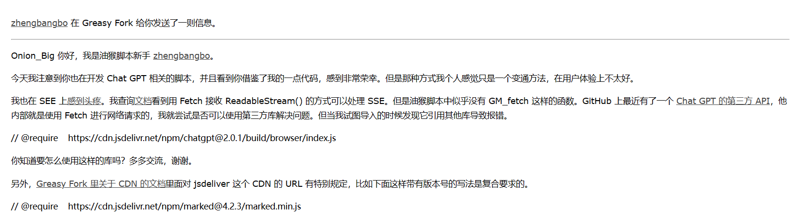
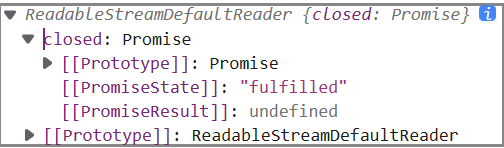
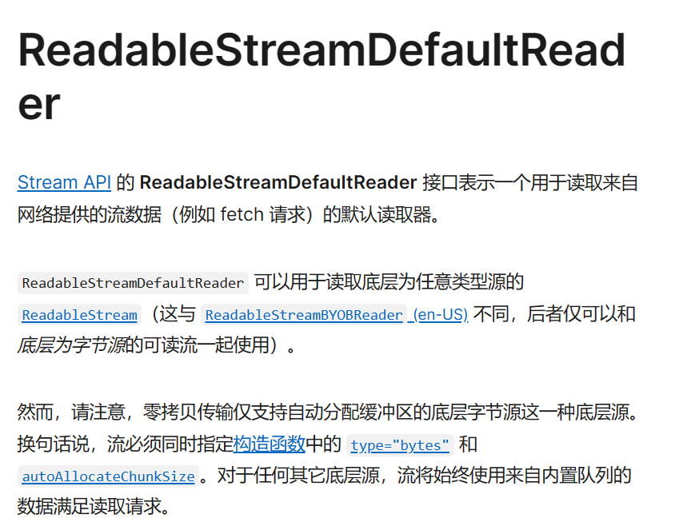
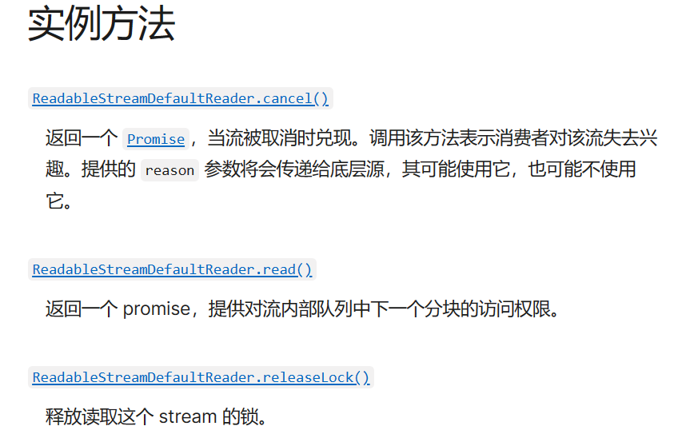
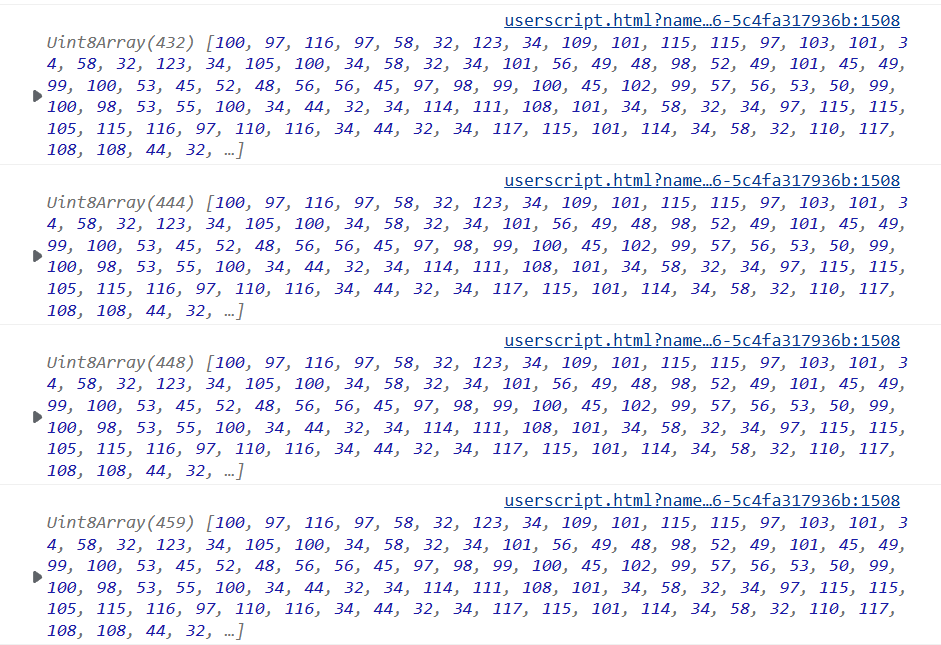

# chatGPT 接入搜索引擎实战教学（二）eventStream的接收
# chatGPT tools plus++
<a href="https://greasyfork.org/zh-CN/scripts/456131-chatgpt-tools-plus-cookie%E7%89%88"></a>  <a href="https://github.com/LiWeny16/chatGPT-tool-plus/blob/main/LICENSE"></a>  <a href="https://github.com/LiWeny16/chatGPT-tool-plus"></a>
  <a href="https://scriptcat.org/script-show-page/756"></a>

  
## 难度级别
+ **草履虫头目**
+ ~~大妈~~
+ ~~小学生~~
+ ~~博士生~~

## 关于我和zhengbangbo的故事 
<br>

在他注意到我借鉴了他接收SSE的方式代码后，他给我发了私信：

受到他的启发，我开始继续追寻如何接收SSE类型，找来找去也没有关于油猴的资料，就当我`陷入迷茫与绝望的时候`  
我想到了福尔摩斯的一句话
```
排除了所有不可能，剩下的就是真相   --福尔摩斯  
```

## 转机

这也就是说，油猴一般只会用GM_xmlhttpRequest函数来跨域，而这里必须跨域请求，那么，再去仔细看看GM_xmlhttpRequest的参数说不定会有效果，于是我又看了几遍details参数，欸，等等，这是什么？

+ onloadstart callback to be executed on load start, provides access to the stream object if responseType is set to "stream"

这不就是stream类型吗，我试试他返回了什么数据类型吧，于是在
+ responseType one of arraybuffer, blob, json or stream

这不就有stream类型吗！<br>
responseType 里面设置为stream ，onloadstart 里面打印返回的结果
<br>  
是Readablestream类型，等等，我记得之前在看到fetch接收的时候也见过这个类型
[https://developer.mozilla.org/zh-CN/docs/Web/API/ReadableStream/ReadableStream](https://developer.mozilla.org/zh-CN/docs/Web/API/ReadableStream/ReadableStream)<br>
在我仔细的翻找之下，终于找到了stream的构造以及接收方法，以下是接收方法

```js
        onloadstart:(stream)=>{ 
            const reader = stream.response.getReader();
            let charsReceived = 0;
            reader.read().then(function processText({ done, value }) {
                if (done) {
                    return;
                }
                charsReceived += value.length;
                console.log(value)
                return reader.read().then(processText);
            });
        },
        responseType:"stream",
```
以下是具体解释：<br>
+ Readablestream类型带有一个getReader方法，返回一个
+ ReadableStreamDefaultReader类型  
<br>
<br>
<br>

+ 同时这个类型带有一个重要的read方法<br>
<br>
<br>

<br>
<br>

+ read()方法返回一个promise<br>
promise.then方法中就带着done和value参数  
done表示传输是否结束，结束为1，没结束为0  
value则表示每一次传输的数据，让我们直接输出value看看吧

<br>
<br>

我超，真的拿到了数据!但是怎么是一堆Uint8Array数组啊


难道是？

## (二)完结

