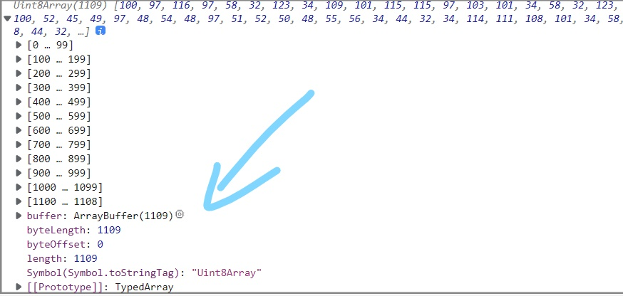
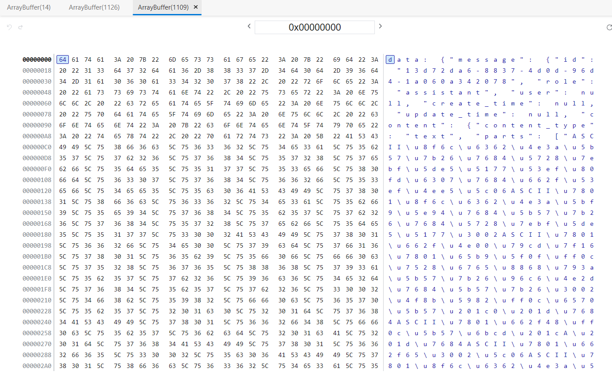
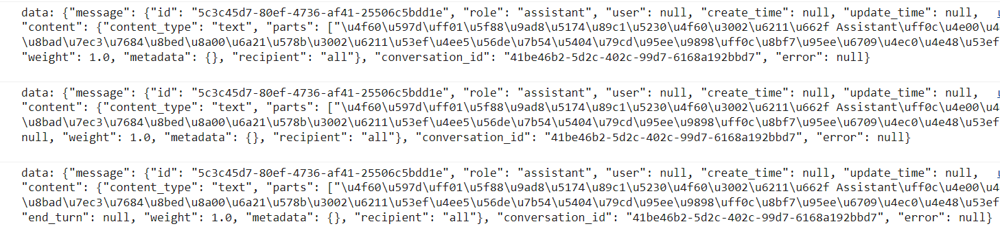
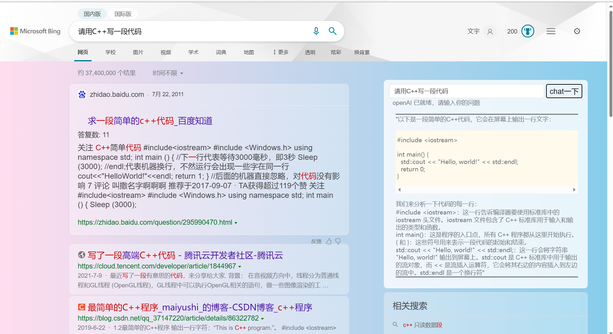

# chatGPT 接入搜索引擎实战教学（三）eventStream 的数据处理

# chatGPT tools plus++

<a href="https://greasyfork.org/zh-CN/scripts/456131-chatgpt-tools-plus-cookie%E7%89%88"></a> <a href="https://github.com/LiWeny16/chatGPT-tool-plus/blob/main/LICENSE"></a> <a href="https://github.com/LiWeny16/chatGPT-tool-plus"></a>
<a href="https://scriptcat.org/script-show-page/756"></a>
<a href="https://bigonion.cn"></a>


## 难度级别

- **草履虫**
- ~~大妈~~
- ~~小学生~~
- ~~博士生~~

## 那些 Uint8Array 数组是什么？

上回说到，看到一堆不停打印的 Uint8Array 数组，em？这都是啥？  
 <br>
难道是？  
看到这些数字基本没有超过 120 的，我心里有了一个答案，也许是 ASCII 码？  
此时对其中一个数组点击展开  
然后，只需要点击这个小图标来到内存查看器  
<br>  
<br>  
真的看到解码后的数据了耶！  
让我们来看看他到底经历了什么变换吧！  
首先我们的原始数据为

```
[100, 97, 116, 97, 58, 32, 123, 34......]
```

对其每一项十进制转十六进制可以得到

```
[64,61,74,61,3A,20,7B,22]
```

| dec    | hex    | character |
| ------ | ------ | --------- |
| 100    | 64     | d         |
| 97     | 61     | a         |
| 116    | 74     | t         |
| 97     | 61     | a         |
| ...... | ...... | ......    |
|        |        |

这不就轻轻松松拿到了真正的数据了吗，只需要把所有的数组里面的数字都转成 ASCII 字符，我们只需要打表，循环转换，然后...那当然是不可能滴，js 中有现成的转换 ASCII 函数:[String.fromCharCode()](https://developer.mozilla.org/zh-CN/docs/Web/JavaScript/Reference/Global_Objects/String/fromCharCode)  
只需要丢给他十进制数字，他就能帮你转成 ASCII 字符，例如:

```js
String.fromCharCode(103, 103, 110, 98);
```

返回什么大家可以自己试试看  
什么？你不知道 ASCII 码？[点我了解 ASCII 码](https://www.zhihu.com/question/419185359)  
就当我以为胜券在握的时候，没想到直接往里面丢数组居然报错了

```
String.fromCharCode([1,2,3,4,5])
```

这样居然不可以！
我也想过丢字符串去掉"[""]"进去，但是发现这个函数只能接收 1,2,3,4,5 这种形式，最后还是 Google 到了解决方法:
String.fromCharCode.apply(null,Array)  
这个我在 MDN 也没找到解释，但是真的能用。。。

```js
String.fromCharCode.apply(null, [100, 97, 100, 97]); //大家自个试试
```

接下来我们看看转成字符后的输出吧！<br>
<br>

那么再接下来的事情就很清晰明朗了，对所有返回的 8bitarray 转成 ASCII 字符后，接着想办法拿到真正的回复内容，回复内容是 parts 里面的东西，一看就知道用的是 Unicode 编码，这个 js 中也有现成的函数。  
什么,还不知道什么是 Unicode 编码？[点我，了解 Unicode 和 utf-8 的区别与关系](https://www.cnblogs.com/xiaoran991/p/12497238.html)

```js
unescape("\u8f6c\u6362"); //输出：转换
```

好的我们已经拿到 parts 里面的数据了
我比较喜欢用正则匹配，大家也可以各显神通，什么 Slice，什么 Split 啊包括 JSON.parse 转成 JSON 对象再调用啊都可以，下面就只用正则匹配的方式来阐述。  
什么？你还不知道什么是正则表达式？[点我，十分钟了解正则！](https://www.bilibili.com/video/BV1da4y1p7iZ/?spm_id_from=333.337.search-card.all.click&vd_source=347109678632e4593a175ba64105c5ff)  
下面是示例代码

```js
const chunk = value;
result += chunk;
normalArray = Array.from(chunk); //没有这一步也可以
nowResult = String.fromCharCode
  .apply(null, normalArray)
  .match(/(?<=\[).*(?=\])/g)[0]; //取出真正的回答内容

if (nowResult !== "DONE") {
  finalResult = nowResult;
}

document.getElementById("gptAnswer").innerHTML = mdConverter(
  decodeUnicode(finalResult.replace(/\\n+/g, "\n"))
);

function decodeUnicode(str) {
  str = str.replace(/\\/g, "%");
  str = unescape(str);
  str = str.replace(/%/g, "\\");
  str = str.replace(/\\/g, "");
  return str;
}
```

finalResult 取出来之后，观察发现带有很多形如\nn 的换行符，所以需要稍微修剪一下把他们统一换成\n,最后用 Unicode 解码，然后用第三方 markdown 转 HTML 的解析 js 库来转换，最后改改样式，呈现到浏览器页面上！  
<br>

## 杂谈

GM_xmlhttprequest 提供的 fetch 方式难道不可以吗？答案是，可以，但是返回的也是一个 ReadableStream 对象，和 XMLHttpRequest 在这里的处理方式基本没有区别，也是要在 onloadstart 对这个对象进行读取处理，并且 fetch 有一个问题，即不能对其进行 abort 也不支持超时控制，所以在这里，XHR 是更为优质的选择  
其实这中间经历了很多无用的尝试，教程里面其实也没有都写出来，主要是为了阅读体验能好一点，当然也不会像教程里说的那么轻描淡写啦

## 后记

找到解决方法后，和 zbbgg 分享了如何解决的方法,也是荣幸出现在致谢表里了 😁<br>

<br>
<br>
<br>

## 关于

作者：Onion  
邮箱：bigonion@bigonion.cn  
声明：未经本人同意，禁止转载、搬运、抄袭！

NameSpace: https://bigonion.cn  
Origin:https://bigonion.cn/blog

## (三)完结
